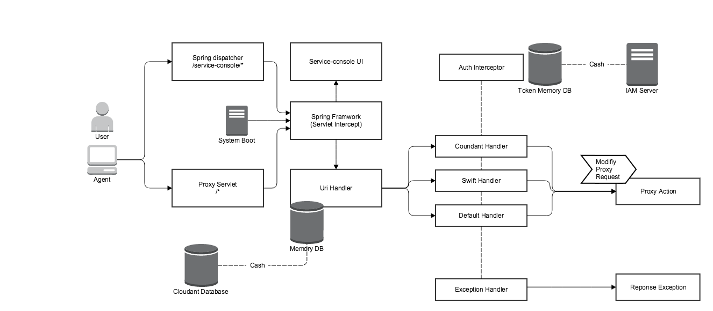
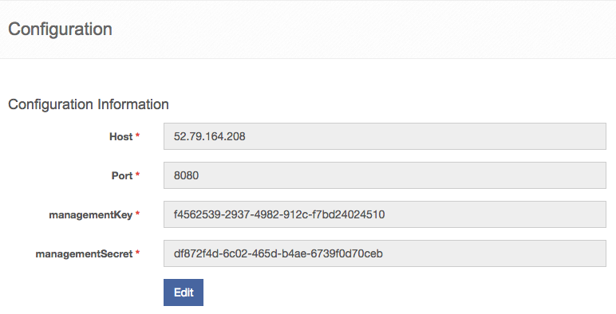
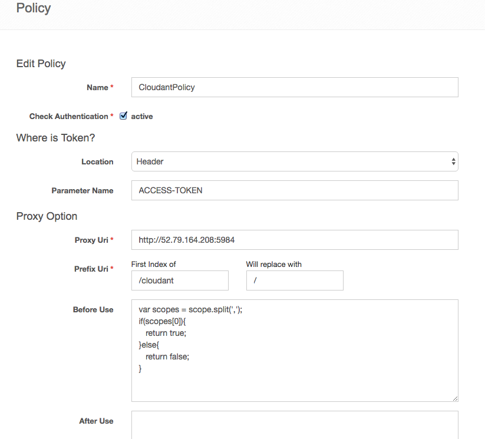
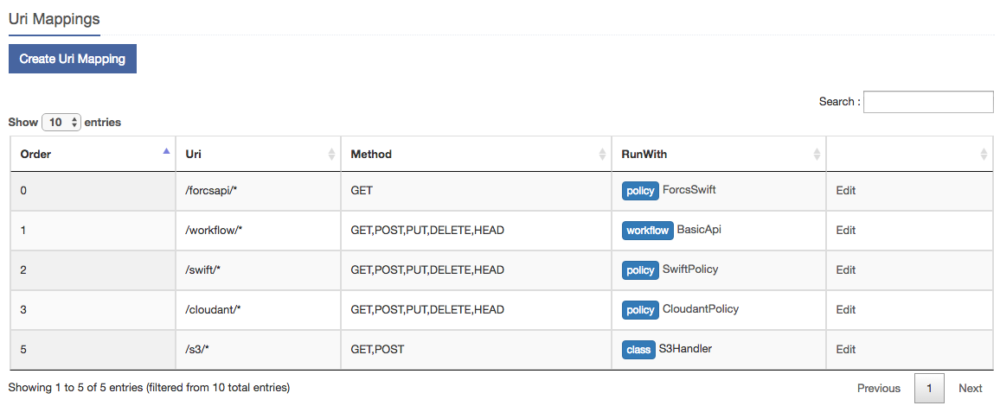
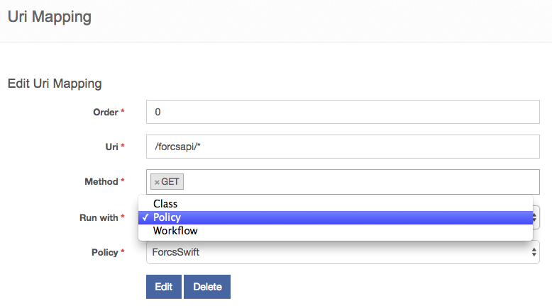
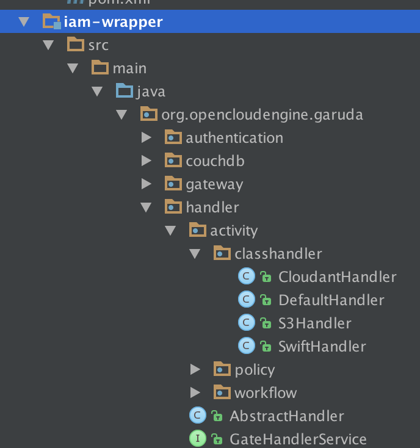
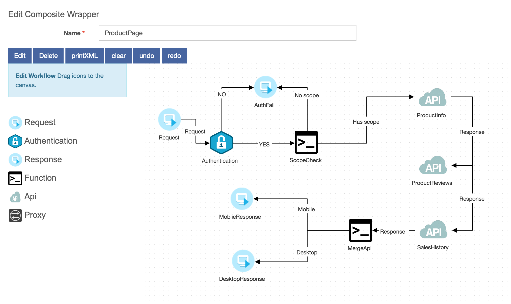
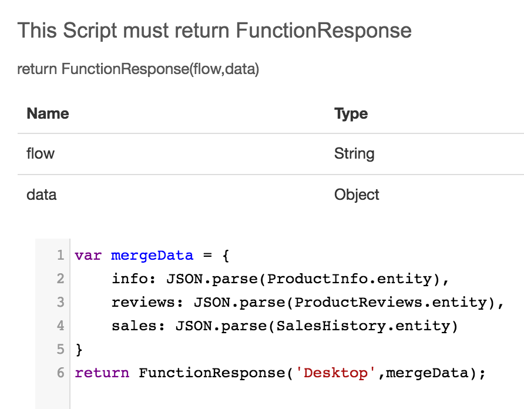

# OCE IAM

## Tutorial

### Architecture



서비스 래퍼는 동일한 스프링 프레임워크 내의 2가지의 서블릿 구조를 가지고 있습니다.

하나는 / path 로 시작하는 Proxy Servlet 이고, 나머지 하나는 /service-console 로 시작하는 UI 컨트롤러 입니다.

서버를 구동 후 UI 에 접근하기 위해서는 /service-console/index 로 접근하도록 합니다.


#### Spec

 - tomcat8
 
 - java8
 
 - couchDB

#### Features

**개발된 기능들**

- Proxy Server

- Custom Handler registration

- URI Mapping using same way as the Servlet Mapping rule

- URI Mapping using Cash Memory

- Https Support

- Broken Pipe error handling

- Authentication processing using Cash Memory

- Authentication information embed in Custom script 

- UI Security

- Gateway Workflow compliance with the Bpmn 2.0 Standard Spec


**추후 추가될 기능들**

- Multiple 토큰 Location 지원

- Auto Refresh Token Flow 지원
 
- 성능 모니터링

- 트랜잭션 별 로그 및 추적 기능 처리


### Configuration

메뉴의 Configuration 에서 연동될 IAM 서버를 설정할 수 있습니다.



 - Host : Iam 서버 호스트
 
 - Port : Iam 서버 포트
 
 - managementKey : Iam 에서 생성한 managementKey
 
 - managementSecret : Iam 에서 생성한 managementSecret

### Simple Wrapper

Simple Wrapper 는 단일 프로세스로 프록시 서버 수행 규칙을 수행하는 메뉴입니다.



 - Name : 규칙 이름
 
 - Check Authentication : 체크시 인증 여부를 검증합니다.
 
 - Location : Check Authentication 이 활성화 되 있을 경우 필수값. 토큰의 위치입니다.
 
 - Parameter Name : Check Authentication 이 활성화 되 있을 경우 필수값. 토큰의 파라미터 이름입니다.
 
 - Target Uri : 프락시 동작을 위한 타겟 호스트입니다.
 
 - Prefix Uri : 프락시 동작시 일부 Path Information 을 수정하기 위한 옵션입니다.
 
 - Before Use : 프락시 동작을 하기 전 실행될 스크립트입니다. true, false 에 따라 동작 여부를 결정합니다.
  Authentication 이 active 이면 Authentication 후에 이 스크립트를 수행합니다.
  스크립트에서 임베드 할 수 있는 객체는 client,user,scope,token_type,claim,type 입니다.
  또한 XMLHttpRequest 객체를 사용하여 외부 통신을 할 수 있습니다.
  
예)XMLHttpRequest

```
var flag = false;
var xh = new XMLHttpRequest();
var result;
var url = "http://...";
xh.onreadystatechange = function(){
    if(xh.readyState == 4 && xh.status == 200){
       var res = xh.responseText;
       var parse = JSON.parse(res);
       log(JSON.stringify(parse));
       var rows = parse['rows'];
       if(rows.length > 0){
         flag = true;
       }
    }
}
return flag;
```

예)임베드 객체 사용

```
if(user.tenant ==! 'KR'){
    return false;
}else{
    return true;
}
```

 - After Use : 프락시 동작 후 실행될 스크립트 입니다. Before Use 와 사용법은 동일하지만, 결과값에 영향을 받지 않으므로 return 을 줄 필요가 없습니다.
 

### URIS

URIS 메뉴에서는 서비스래퍼의 / 패스로 들어오는 모든 리퀘스트에 대하여 어떤 PathInfo 로 들어오냐에 따라 실행할 프로세스 를 매핑시키는 기능을 수행합니다.
 
다음은 몇가지 URIS 를 등록한 화면입니다.



Order 순차로 나열되어 있는 Uri 값의 표현은 서블릿의 web.xml 과 같은 방식으로 구성됩니다.

예) web.xml 서블릿 매핑 의 구성

```
<servlet-mapping>
    <servlet-name>rule1</servlet-name>
    <url-pattern>/rule1/*</url-pattern>
</servlet-mapping>
<servlet-mapping>
    <servlet-name>rule2</servlet-name>
    <url-pattern>/rule2/*</url-pattern>
</servlet-mapping>
<servlet-mapping>
    <servlet-name>rule3</servlet-name>
    <url-pattern>/rule3/*</url-pattern>
</servlet-mapping>
.
.
```

서비스래퍼의 / 패스 로 들어오는 리퀘스트의 Uri 와 Method 가 일치한다면 Runwith 에 위치한 프로세스를 수행하는데, Order 순으로 먼저 일치하는 프로세스를 수행하게 됩니다.

다음은 Uri Mapping 을 설정하는 화면입니다.



 - Order : 서블릿 매핑 순서
 
 - Uri : 서블릿 url 패턴

Uri 패턴은 Path Variable 표현도 가능합니다.

예) Path Variable 패턴

```
/{tenantId}/api/{userId}/*
```

 - Method : 해당하는 메소드일 경우만 매핑이 성립합니다.
 
 - Run with : 어떠한 프로세스를 수행할지 결정합니다. Class, Policy, Workflow 를 선택할 수 있습니다.
 
#### Class Process

Run with 를 Class Process 로 설정할 경우, 클래스 이름을 등록하면 해당 클래스 프로세스를 수행합니다.
 
등록한 클래스 이름은 소스코드의 org/opencloudengine/garuda/handler/activity/classhandler 폴더 하위에 생성을 해야 합니다.

예) CloudantHandler, DefaultHandler, S3Handler, SwiftHandler 를 등록하였을 경우



클래스의 작성법의 기본 템플릿 예제를 살펴보겠습니다.

**CloudantHandler.java**

```
package org.opencloudengine.garuda.handler.activity.classhandler;

import org.opencloudengine.garuda.gateway.GateException;
import org.opencloudengine.garuda.handler.AbstractHandler;
import org.opencloudengine.garuda.model.AuthInformation;
import org.opencloudengine.garuda.proxy.ProxyRequest;

/**
 * Created by uengine on 2016. 6. 16..
 */
public class CloudantHandler extends AbstractHandler {

    @Override
    public void doAction() {

        //토큰을 인증한다.
        AuthInformation authInformation = securityService.validateRequest(
                servletRequest,
                "ACCESS-TOKEN",  : 토큰 파라미터 이름
                AuthInformation.LOCATION_HEADER, : 토큰의 위치
                AuthInformation.TOKEN_TYPE_JWT); : 토큰의 타입(TOKEN_TYPE_JWT,TOKEN_TYPE_BEARER)

        //인증이 실패한경우의 처리.
        if (authInformation.getError() != null) {
            gatewayService.errorResponse(
                    GateException.AUTHENTICATION_FAIL,
                    servletRequest,
                    servletResponse,
                    null);
            return;
        }
        
        /**
        * 이 구간에 커스텀한 로직을 사용할 수 있습니다.
        **/

        //인증이 성공할 경우 프록시 처리
        ProxyRequest proxyRequest = new ProxyRequest();
        proxyRequest.setProxyServlet(gatewayServlet);
        proxyRequest.setRequest(servletRequest);
        proxyRequest.setResponse(servletResponse);
        proxyRequest.setHost("http://52.79.164.208:5984"); : 프록시 타켓 호스트

        proxyRequest.setPath(servletRequest.getPathInfo().replace("/cloudant", "")); : 프록시 Path 등록
        proxyService.doProxy(proxyRequest);
        
        /**
        * 이 구간에 커스텀한 로직을 사용할 수 있습니다.
        **/
    }
}
```

Simple Wrapper 메뉴에서 설정하는 값들을 직접 클래스 내에서 줄 수 있고, Simple Wrapper 메뉴에서의 Script 방식을 원하지 않을 경우 추천드립니다.

또한 Class 를 등록하실 경우는 소스를 다시 빌드하여 재배포하여야 합니다.

#### Simple Wrapper Process

Run with 를 Simple Wrapper 로 설정할 경우 Policy 메뉴를 통해 등록한 규칙을 수행합니다.

#### Composite Wrapper Process

Run with 를 Composite Wrapper 로 설정할 경우 Workflow 메뉴를 통해 등록한 규칙을 수행합니다.


### Composite Wrappers

Composite Wrapper 를 사용할 경우 다음과 같은 이점이 있습니다.

- 트랜잭션의 구간별 추적

- 트랜잭션의 Duration 타임 측정

- Api 의 메세지 컨버트

- 다수의 Api 를 콜하여 하나의 리스폰스로 전달



Composite Wrapper 에서는 6가지 타입의 Activity 를 사용할 수 있습니다.

#### Activity 공통

모든 Activity 는 실행후 결과값을 지니고 있습니다.

Activity 의 결과값은 다른 Activity 에서 script 를 작성시 참조할 수 있습니다.

단, 프로세스 상에서 아직 실행되지 않은 Activity 는 참조할 수 없습니다.

 - 다른 Activity 참조 스크립트 예제



#### Request

Request 는 따로 설정값이 없으며, 래퍼 서비스로 들어오는 리퀘스트에 대한 정보를 지니고 있게 됩니다.

프로세스는 반드시 **Request** 로 시작하여야 합니다.

 - 결과값

| 파라미터     | 타입   | 설명            |
|--------------|--------|-----------------|
| uri          | String | 리퀘스트 URI    |
| pathVarialbe | Map    | 패스 파라미터   |
| headers      | Map    | 헤더            |
| method       | String | 리퀘스트 메소드 |

#### Authentication

Authentication 는 인증처리를 담당하는 Activity 입니다.

GUI 상에서 인풋값을 설정합니다.

 - 인풋값
 
| 파라미터       | 타입   | 설명             |
|----------------|--------|------------------|
| Location       | String | 토큰의 위치      |
| Parameter Name | String | 토큰 파라미터 명 |

- 결과값

| 파라미터      | 타입   | 설명                        |
|---------------|--------|-----------------------------|
| tokenName     | String | 토큰 파라미터 명            |
| tokenLocation | String | 토큰의 위치                 |
| token         | String | 토큰                        |
| tokenType     | String | 토큰 타입                   |
| oauthUser     | Map    | 유저 정보                   |
| oauthClient   | Map    | 클라이언트 정보             |
| scopes        | String | 스코프(콤마 세퍼레이트)     |
| type          | String | 토큰 발급 유형(user,client) |
| claim         | Map    | claim object                |

#### Response

Response 는 리퀘스트에 대해 응답을 해주는 객체입니다. 

한 프로세스에 Response 에 중복 호출되지 않도록 로직을 짜야하며, Proxy 액티비티 와도 동일 프로세스에 중복 될 수 없습니다. 


### ANALYSIS

**개발중**